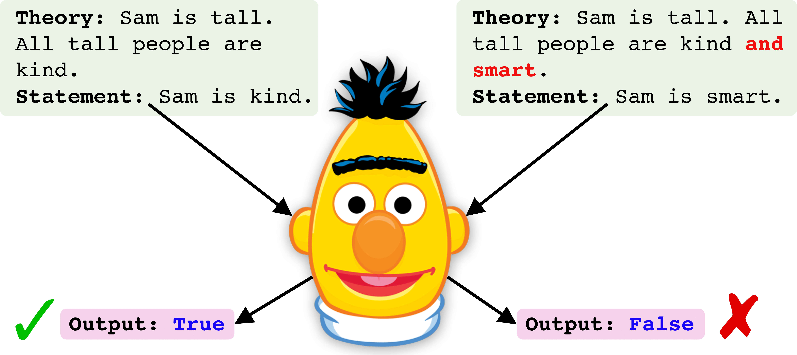

<h1 align="center">
  RobustLR
</h1>

<h4 align="center">RobustLR: A Diagnostic Benchmark for Evaluating Logical Robustness of Deductive Reasoners</h4>

  
  
  
  </a>

<h2 align="center">
  Overview of RobustLR
</h2>

We expect a strong deductive reasoning model should be robust to logical variations in the input. Here, the model fails to understand the logical conjunction in second example and predicts the wrong entailment of the statement.

### Dependencies

+ Dependencies can be installed using `requirements.txt`.

### Pipeline for running code

1. First, download the data from [this link](https://drive.google.com/file/d/1sKViihbwSMP0xTst39AU1QT1q39AZCjP/view?usp=sharing) in a folder named `data`.
2. Next, [tokenize the data](#process-data-to-generate-tokenized-dataset) to be used for training a model
2. Then, [train a model](#finetune-roberta-checkpoint) using the tokenized data, which saves the checkpoint in a folder at `saved`
3. Lastly, [evaluate the checkpoint](#evaluation-on-robustlr-diagnostic-benchmark) on RobustLR consisting of 3 different types of contrast sets and 3 different types of equivalent sets.

<h2></h2>

Below, we show a step-by-step pipleline to train and evaluate a RoBERTa checkpoint. The example is shown for the `all` training dataset that contains all the logical operators at train time [AND, OR, NOT].

#### Process data to generate tokenized dataset
`python process_dataset.py --dataset train_data/all --arch roberta_large_race`

<h2></h2>

#### Finetune RoBERTa checkpoint
We use a RoBERTa checkpoint finetuned on RACE. The model can be changed via config at `src/configs/config.yaml`

`python main.py --dataset all --train_dataset all --dev_dataset all --test_dataset all`

<h2></h2>

#### Evaluation on RobustLR diagnostic benchmark
Replace the `<model_ckpt>` in below command to the saved checkpoint path from model finetuning done above.
<h2></h2>

##### Conjunction Contrast Set
`python process_dataset.py --dataset robustlr/logical_contrast/conj_contrast_with_distractors --eval`

`python main.py --override evaluate --dataset conj_contrast_with_distractors --train_dataset conj_contrast_with_distractors --dev_dataset conj_contrast_with_distractors --test_dataset conj_contrast_with_distractors --ckpt_path <model_ckpt>`

##### Disjunction Contrast Set
`python process_dataset.py --dataset robustlr/logical_contrast/disj_contrast_with_distractors --eval`

`python main.py --override evaluate --dataset disj_contrast_with_distractors --train_dataset disj_contrast_with_distractors --dev_dataset disj_contrast_with_distractors --test_dataset disj_contrast_with_distractors --ckpt_path <model_ckpt>`

##### Negation Contrast Set
`python process_dataset.py --dataset robustlr/logical_contrast/neg_contrast_with_distractors --eval`

`python main.py --override evaluate --dataset neg_contrast_with_distractors --train_dataset neg_contrast_with_distractors --dev_dataset neg_contrast_with_distractors --test_dataset neg_contrast_with_distractors --ckpt_path <model_ckpt>`

<h2></h2>

##### Contrapositive Equivalence Set
`python process_dataset.py --dataset robustlr/logical_equivalence/contrapositive_equiv --eval`

`python main.py --override evaluate --dataset contrapositive_equiv --train_dataset contrapositive_equiv --dev_dataset contrapositive_equiv --test_dataset contrapositive_equiv --ckpt_path <model_ckpt>`

##### Distributive 1 Equivalence Set
`python process_dataset.py --dataset robustlr/logical_equivalence/distributive1_equiv --eval`

`python main.py --override evaluate --dataset distributive1_equiv --train_dataset distributive1_equiv --dev_dataset distributive1_equiv --test_dataset distributive1_equiv --ckpt_path <model_ckpt>`

##### Distributive 2 Equivalence Set
`python process_dataset.py --dataset robustlr/logical_equivalence/distributive2_equiv --eval`

`python main.py --override evaluate --dataset distributive2_equiv --train_dataset distributive2_equiv --dev_dataset distributive2_equiv --test_dataset distributive2_equiv --ckpt_path <model_ckpt>`

<h2></h2>

For any clarification, comments, or suggestions please create an issue or contact [Soumya](https://soumyasanyal.github.io/).
